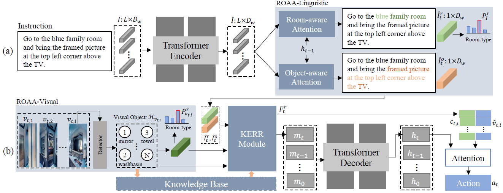

# CKR-nav
Code for our CVPR 2021 paper "[Room-and-Object Aware Knowledge Reasoning for Remote Embodied Referring Expression](https://openaccess.thecvf.com/content/CVPR2021/papers/Gao_Room-and-Object_Aware_Knowledge_Reasoning_for_Remote_Embodied_Referring_Expression_CVPR_2021_paper.pdf)".

Contributed by [Chen Gao*](http://chengaopro.github.io/), Jinyu Chen*, [Si Liu1†](https://scholar.google.com/citations?user=-QtVtNEAAAAJ&hl=zh-CN&oi=ao), Luting Wang, Qiong Zhang, [Qi Wu](https://scholar.google.com/citations?hl=zh-CN&user=aKXe1FEAAAAJ&view_op=list_works&sortby=pubdate)




## Getting Started
### Installation

1. Clone this repository.

    ~~~
    git clone https://github.com/alloldman/CKR.git $CKR-root
    ~~~
2. Install pytorch==1.3.0

    ~~~
    conda install pytorch=1.3.0 cudatoolkit=9.0 torchvision -c pytorch
    ~~~
3. Install the requirements.
    
    ~~~
    pip install -r requirements.txt
    ~~~

## Training and Test
### Dataset Preparation
1. Download ResNet-152 features for Matterport 3D dataset:

    ~~~
    wget https://www.dropbox.com/s/o57kxh2mn5rkx4o/ResNet-152-imagenet.zip -P img_features/
    unzip ResNet-152-imagenet.zip
    ~~~
2. Download the Intermediate data from  [here](https://drive.google.com/drive/folders/1lU6k8DNXThdWXOafHoXC-3UjwCArT84h?usp=sharing).  `data.zip, cache.zip, img_features.zip, best-ckpt.zip` should be unziped. And the [room relation weight](https://drive.google.com/file/d/1edq0HzovQ9jeGnkOk2WAtHHt3hquZ4r5/view?usp=sharing) and the [object relation weight](https://drive.google.com/file/d/1RGAIMP5zRKSIzCUboqAxOv_XIV4lKEA2/view?usp=sharing) should be download.

3. Put these unziped files as the order below:
    ~~~
    CKR
    ├──data
    ├──KB
    │  ├──cache
    |  └─data
    │      ├──relations.npy
    |      └─relations_room.npy            
    ├──experiments
    │  └──best-ckpt
    └──img_features
    └──ResNet-152-imagenet.tsv 
    ~~~
### Training
1. Execute the commond below. '`0`' means using the number 0 GPU. 
~~~
    bash run.sh train 0
~~~
### Test
1. Evalution by our rewritten script and select the best checkpoint. An example evalution on REVERIE dataset as follow. You can change the path to evalution your own checkpoint:

    ```
    bash run.sh search experiments/best-ckpt/follower_pm_sample2step_imagenet_mean_pooled_1heads_train_iter_9300val_seen_sr_0.547_val_unseen_sr_0.138_ 0
    ```

## Citation
Please consider citing this project in your publications if it helps your research. The following is a BibTeX reference. The BibTeX entry requires the url LaTeX package.

~~~
@inproceedings{gao2021room,
  title={Room-and-Object Aware Knowledge Reasoning for Remote Embodied Referring Expression},
  author={Gao, Chen and Chen, Jinyu and Liu, Si and Wang, Luting and Zhang, Qiong and Wu, Qi},
  booktitle={Proceedings of the IEEE/CVF Conference on Computer Vision and Pattern Recognition},
  year={2021}
}
~~~
## License
CKR-nav is released under the MIT license. See [LICENSE](LICENSE) for additional details.
## Acknowledge
Some of the codes are built upon [REVERIE](https://github.com/YuankaiQi/REVERIE) and [babywalk](https://github.com/Sha-Lab/babywalk). Thanks them for their great works!

